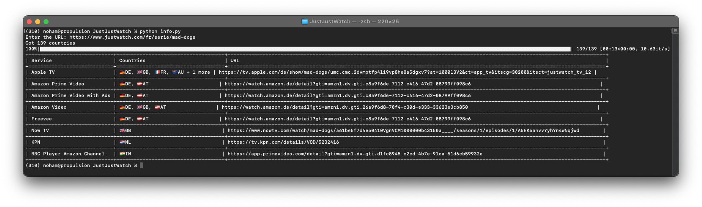
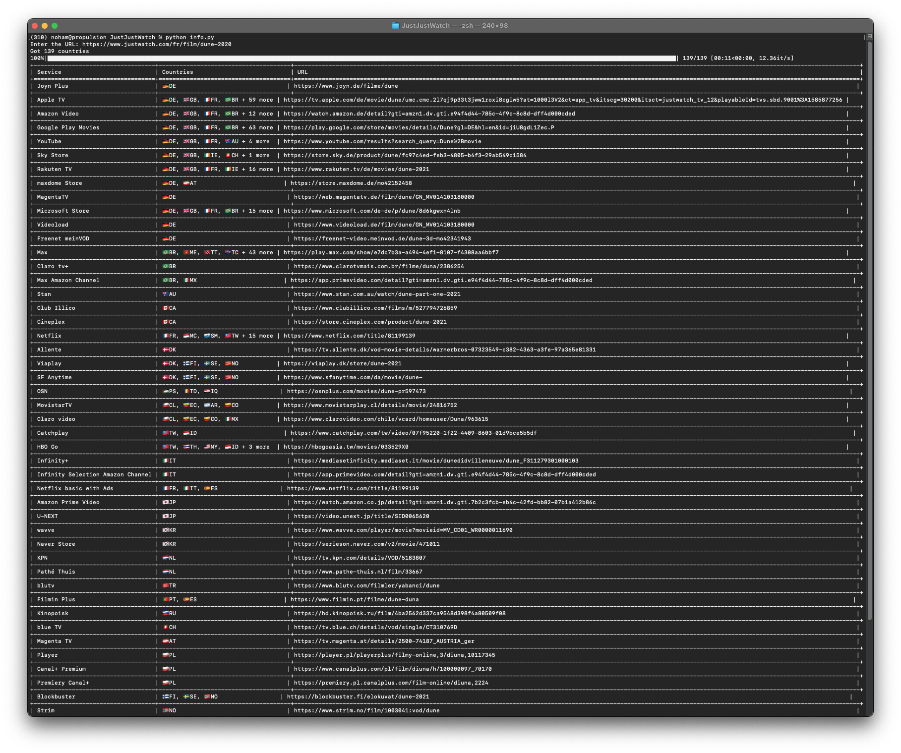

# JustJustWatch

This project pulls data from [JustWatch](https://www.justwatch.com/) and shows details about movies and series.

## Installation
```bash
pip install -r requirements.txt
```

## Usage
```bash
python info.py
```


## Example Usage

### 1. Series Example: Mad Dogs
URL: https://www.justwatch.com/fr/serie/mad-dogs


### 2. Movie Example: Dune (2020)
URL: https://www.justwatch.com/fr/film/dune-2020
