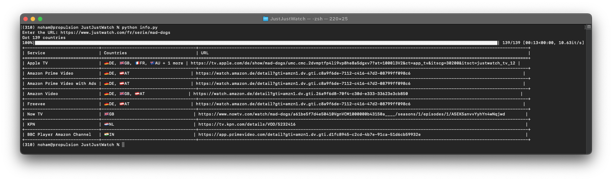
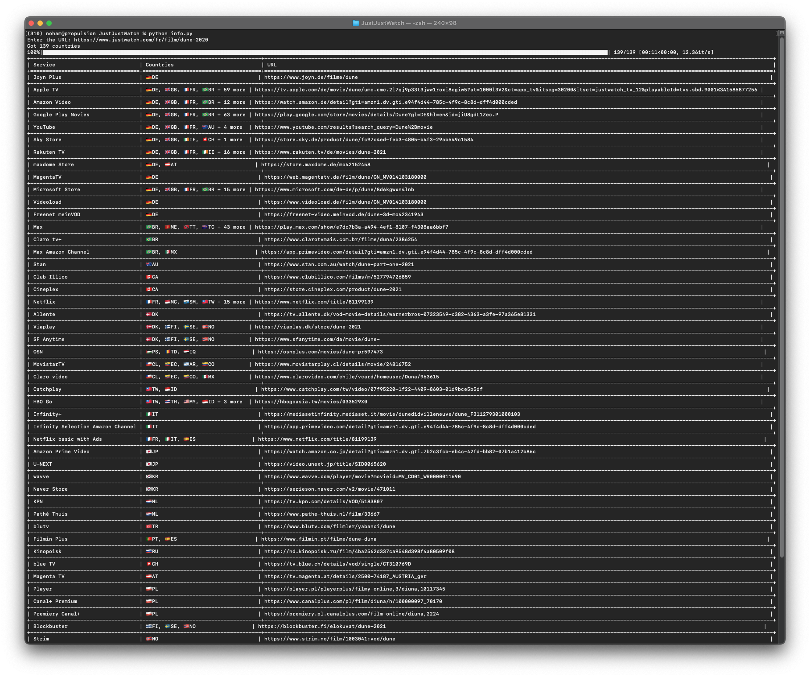

# JustJustWatch

This project pulls data from [JustWatch](https://www.justwatch.com/) and shows details about movies and series.

## Installation
This project uses [uv](https://docs.astral.sh/uv/) as a package manager.
```bash
uv run main.py
```


## Example Usage

### 1. Series Example: Mad Dogs
URL: https://www.justwatch.com/fr/serie/mad-dogs


### 2. Movie Example: Dune (2020)
URL: https://www.justwatch.com/fr/film/dune-2020
